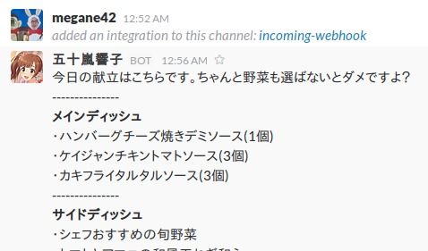

# Kyoko - DexeeDeli 新宿フロントタワー店 献立お知らせ bot

## About
* Kyoko is (unofficial) Slack bot who tells us today's menu of [DexeeDeli Kita Shinjuku](http://www.cardenas.co.jp/shop/dexee-deli/-dexee-diner-750.html).
* Kyoko stands for "KYO no KOndate" (今日の献立: "today's menu" in Japanese).

## Set Up
* `cp .env.sample .env`
* `vim .env` and write:
    * [Microsoft Computer Vision API](https://www.microsoft.com/cognitive-services/en-us/computer-vision-api) key
    * Slack Incoming Webhook URL
* Set icon and bot name from Slack web page

## Run Natively
* install requirements:
    * `sudo apt-get install imagemagick libmagickwand-dev ghostscript`
    * `pip install -r requirements.txt`
* and run:
    * `python kyoko.py`

## Run on Docker
* `docker run --rm --env-file /path/to/.env megane42/kyoko`

## Run Periodically
* use cron
    * Kyoko does not have any mechanism to run periodically

## Test
* `py.test`

## Author
* megane42
    * https://github.com/megane42
    * https://twitter.com/megane42

## License
* MIT
